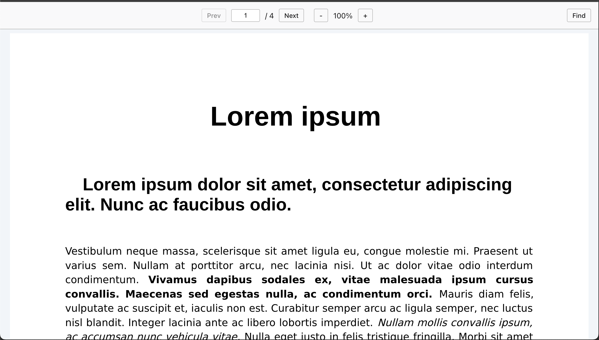

# react-pdf-js-viewer (Monorepo)

This repository is a monorepo containing the `react-pdf-js-viewer` package and its demo application.
* **`packages/react-pdf-js-viewer`**: The published npm package.
* **`apps/demo`**: A Vite + React demo app for local development.

## Screenshot




## 🚀 Local Development

This project uses **pnpm** as a package manager.

1.  **Install dependencies:**
    ```bash
    pnpm install
    ```

2.  **Run the demo app:**
    This will start the demo app on `http://localhost:5173`.
    ```bash
    pnpm demo
    ```

3.  **Build the library:**
    To run a production build of the `react-pdf-js-viewer` package:
    ```bash
    pnpm build:lib
    ```

## 📜 License

This project is licensed under the Apache 2.0 License.